# ecommerce-mlops

[](https://github.com/perpetualxbeta-ai/ecommerce-mlops/actions/workflows/ci.yml)

End-to-end MLOps practice project: **real-time fraud detection for an e-commerce platform**.
Synthetic transactions stream through Kafka into PostgreSQL. An XGBoost model is trained with point-in-time
features, tracked and versioned in MLflow, and promoted to Production only if it beats the current model.
A FastAPI service scores live transactions with whatever model is currently in Production, hot-swapping
new versions without a restart.

```
transaction ──► POST /predict ──► {"fraud_probability": 0.998, "decision": "BLOCK",
                                    "top_factors": ["31x user's average spend", "new country", ...]}
```

---

## Contents

- [Architecture](#architecture)
- [Repository layout](#repository-layout)
- [Quickstart](#quickstart)
- [Components](#components)
  - [1. Data simulator](#1-data-simulator)
  - [2. Streaming ingestion (Kafka → Postgres)](#2-streaming-ingestion-kafka--postgres)
  - [3. Feature engineering](#3-feature-engineering)
  - [4. Training & model registry](#4-training--model-registry)
  - [5. Real-time scoring API](#5-real-time-scoring-api)
- [Configuration](#configuration)
- [Testing & CI](#testing--ci)
- [Results](#results)
- [Design decisions & lessons learned](#design-decisions--lessons-learned)
- [Limitations & roadmap](#limitations--roadmap)
- [Troubleshooting](#troubleshooting)

---

## Architecture

```mermaid
flowchart LR
    subgraph Ingestion
        SIM[data_simulator<br/>synthetic transactions] --> PROD[Kafka producer]
        PROD -->|topic: transactions<br/>key = user_id| KAFKA[(Kafka)]
        KAFKA --> CONS[Kafka consumer<br/>at-least-once, idempotent]
    end

    CONS -->|raw events| PG[(PostgreSQL<br/>transactions · predictions)]
    SIM -. "--to-postgres backfill" .-> PG

    subgraph Training
        PG -->|latest N rows| FEAT1[build_features<br/>point-in-time]
        FEAT1 --> TRAIN[train.py<br/>XGBoost + time split<br/>+ hyper-param search]
    end

    TRAIN -->|params · metrics · plots · model| MLF[(MLflow<br/>tracking + registry)]
    TRAIN -->|champion vs challenger| REG{beats Production?}
    REG -->|yes| ALIAS[alias: production<br/>stage: Production]
    ALIAS --- MLF

    subgraph Serving
        CLIENT([client / checkout]) -->|POST /predict| API[FastAPI]
        API -->|user history| PG
        API --> FEAT2[build_online_features<br/>same code as training]
        FEAT2 --> MODEL[in-memory<br/>Production model]
        MODEL -->|BLOCK / REVIEW / ALLOW<br/>+ SHAP factors| CLIENT
        API -->|log prediction| PG
    end

    MLF -->|poll every 60s,<br/>hot-swap on promotion| MODEL
```



**Three paths through the system**

| Path | Flow | Latency |
|---|---|---|
| **Ingestion** | simulator → producer → Kafka → consumer → Postgres `transactions` | continuous |
| **Training** | Postgres → features → XGBoost → MLflow (log + register + promote) | minutes, on demand |
| **Serving** | request → user history from Postgres → features → Production model → decision | ~70 ms p50 |

**Infrastructure** (all in `docker-compose.yml`)

| Service | Image | Purpose | Port |
|---|---|---|---|
| Zookeeper | `confluentinc/cp-zookeeper:7.6.1` | Kafka coordination | 2181 |
| Kafka | `confluentinc/cp-kafka:7.6.1` | event stream | 9092 (host) / 29092 (containers) |
| PostgreSQL | `postgres:16` | transactions, predictions, MLflow backend store | 5432 |
| MLflow | `mlflow:v3.16.1` + psycopg2 | experiment tracking, model registry, artifact serving | 5000 |
| Fraud API | `python:3.11-slim` + this repo | real-time scoring | 8000 |

---

## Repository layout

```
.
├── .github/workflows/ci.yml      # lint · tests (with Postgres) · Docker build & boot
├── docker/
│   ├── api/Dockerfile            # scoring API image
│   ├── mlflow/Dockerfile         # MLflow server + Postgres driver
│   └── postgres/init.sql         # creates mlflow DB, transactions & predictions tables
├── docker-compose.yml
├── data/{raw,processed}/         # local datasets (git-ignored)
├── notebooks/                    # exploration
├── src/
│   ├── config.py                 # env-driven settings (Kafka, Postgres)
│   ├── data_simulator.py         # synthetic users, transactions & fraud patterns
│   ├── streaming/
│   │   ├── producer.py           # simulator → Kafka
│   │   └── consumer.py           # Kafka → Postgres
│   ├── features/
│   │   └── build_features.py     # offline + online features, FEATURE_VERSION
│   ├── models/
│   │   └── train.py              # training, MLflow logging, registry promotion
│   └── api/
│       ├── main.py               # FastAPI app & endpoints
│       ├── model_manager.py      # loads / hot-swaps the Production model
│       ├── store.py              # Postgres: history, category stats, prediction log
│       └── schemas.py            # request / response models
├── tests/                        # 31 tests (see Testing & CI)
├── pyproject.toml                # ruff + pytest config
└── requirements.txt
```

---

## Quickstart

**Prerequisites:** Docker (with Compose v2) and Python 3.11+.

```bash
git clone https://github.com/perpetualxbeta-ai/ecommerce-mlops.git
cd ecommerce-mlops

# 1. Infrastructure: Kafka, Zookeeper, Postgres, MLflow
cp .env.example .env
docker compose up -d --build zookeeper kafka postgres mlflow

# 2. Python environment
python -m venv .venv && source .venv/bin/activate     # Windows: .venv\Scripts\activate
pip install -r requirements.txt

# 3. Training data: backfill 60 days of history straight into Postgres
python -m src.data_simulator --n 60000 --days 60 --to-postgres

# 4. Train, log to MLflow and promote to Production
python -m src.models.train
#    → open http://localhost:5000 to see runs, metrics and the registered model

# 5. Serve
docker compose up -d --build api          # or locally: uvicorn src.api.main:app --port 8000
#    → open http://localhost:8000/docs for the interactive Swagger UI

# 6. Score a transaction
curl -X POST localhost:8000/predict -H 'content-type: application/json' -d '{
  "user_id": "user_00111", "transaction_amount": 2900, "merchant_category": "jewelry",
  "payment_method": "credit_card", "country": "GB", "device_type": "web_desktop"
}'
```

**Live streaming** (optional, two more terminals):

```bash
python -m src.streaming.consumer                 # Kafka → Postgres
python -m src.streaming.producer --rate 5        # 5 transactions / second
```

---

## Components

### 1. Data simulator

`src/data_simulator.py` generates realistic-enough transactions for a model to learn from.

- **Users have stable profiles:** home country, spending level, three favourite categories, usual device and payment method. Normal behaviour is therefore consistent per user, and fraud shows up as a *deviation* from it.
- **Amounts** are log-normal around a per-category median, scaled by the user's spending level.
- **Shopping hours** follow a daytime-heavy curve in each country's **local time**; timestamps are stored in UTC.
- **Four fraud patterns** (~2% of transactions; `--fraud-rate` is calibrated so it is the true share):

| Pattern | Signature |
|---|---|
| `card_testing` | burst of 3–6 tiny `digital_goods` charges ~20 s apart, foreign country, new device |
| `account_takeover` | 3–8× normal spend on electronics / gift cards / jewelry / travel, foreign country, new device |
| `high_risk_spend` | 4–10× normal spend in a high-risk category |
| `odd_hours` | 2–6× normal spend between 01:00 and 05:00 local time |

| Field | Notes |
|---|---|
| `transaction_id` | UUID; primary key, which makes consumer writes idempotent |
| `user_id` | Kafka message key |
| `transaction_amount` | USD |
| `merchant_category` | grocery, fashion, electronics, home_garden, beauty, sports, books_media, travel, digital_goods, gift_cards, jewelry |
| `timestamp` | ISO-8601, UTC |
| `is_fraud` | label (0/1) |
| `payment_method`, `country`, `device_type` | context fields |
| `fraud_type` | which pattern generated it. **For analysis only; never a feature, because it leaks the label.** |

```bash
python -m src.data_simulator --n 10000 --out data/raw/transactions.csv   # CSV for notebooks
python -m src.data_simulator --n 60000 --days 60 --to-postgres            # backfill the DB
```

### 2. Streaming ingestion (Kafka → Postgres)

**Producer** (`src/streaming/producer.py`)
- Sends JSON messages **keyed by `user_id`**, so all of a user's events land on one partition, in order. Velocity features depend on that ordering.
- Uses `acks=all`, a configurable `--rate` and `--max`, and connection retries while Kafka is still starting.

**Consumer** (`src/streaming/consumer.py`) gives **at-least-once delivery with idempotent writes**:
- Offsets are committed to Kafka only *after* the Postgres transaction commits, so a crash never loses data.
- `INSERT … ON CONFLICT (transaction_id) DO NOTHING`, so replays after a crash never create duplicates.
- If a database write fails, the batch is rolled back and the consumer rewinds to the batch's first offset to retry it.
- Malformed messages (bad JSON or missing fields) are logged and skipped, so they don't block the partition.

### 3. Feature engineering

`src/features/build_features.py`. Every feature for a transaction uses **only that user's earlier
transactions**, never the current row or anything later. Training therefore sees exactly what a real-time
scorer could know at decision time (no look-ahead leakage). Tests verify this by brute-force recomputation,
and by checking that appending future rows never changes past features.

| Group | Features |
|---|---|
| Amount | `amount`, `log_amount`, `amount_to_user_avg`, `amount_to_user_max`, `amount_zscore_user`, `amount_to_category_avg`, `user_avg_amount` |
| Velocity | `txn_count_10m`, `txn_count_1h`, `txn_count_24h`, `secs_since_last_txn` (+ log) |
| Behaviour change | `is_new_country`, `is_new_device`, `is_new_payment_method`, `is_first_txn`, `user_prior_txn_count` |
| Time (local to the transaction's country) | `hour`, `is_night`, `day_of_week` |
| Categorical | one-hot `merchant_category`, `payment_method`, `device_type` (fixed vocabulary) |

**Training/serving parity.** The API calls `build_online_features`, which runs the *same*
`build_features` over the user's history plus the new transaction and returns that one row. A test checks
that online and offline features match to 1e-9 on 150 random transactions. The only cross-user feature
(`amount_to_category_avg`) uses category averages that the API caches from Postgres.

**`FEATURE_VERSION`.** Bump this constant whenever feature logic changes. Training stamps it on each
model version, and the API refuses to load a model whose feature version differs from its own code (see
[lessons learned](#design-decisions--lessons-learned)).

### 4. Training & model registry

`src/models/train.py`

1. **Load** the latest `--limit` transactions (default 200k) from Postgres.
2. **Split by time:** oldest 70% train, next 15% validation, newest 15% test. No shuffling, because fraud models must be evaluated on the future.
3. **Search** `--n-trials` random hyper-parameter configurations (depth, learning rate, trees, subsampling); each is a **nested MLflow run**. The class imbalance (~2% fraud) is handled with `scale_pos_weight`, plus early stopping on validation PR-AUC.
4. **Select** the best configuration on validation PR-AUC, then tune its **decision threshold** on validation for max F1.
5. **Evaluate once** on the untouched test set.
6. **Log to MLflow:**
   - params
   - `precision`, `recall`, `f1` (test), `test_pr_auc`, `test_roc_auc`, confusion counts
   - PR-curve and feature-importance plots, plus `feature_columns.json`
   - the model with its input signature
7. **Register** a new version of `fraud-detector`, tagged with `threshold`, `feature_columns`, `feature_version` and `test_f1`.
8. **Champion vs challenger:** the current Production model is re-scored on the *same* test set. The new version is promoted only if its F1 is ≥ the champion's (`--force-promote` overrides). Promotion:
   - sets the **`production` alias**, MLflow's current mechanism (`models:/fraud-detector@production`)
   - moves the version to the legacy **"Production" stage**, which still shows in the UI; the previous version is archived

```bash
python -m src.models.train                            # defaults
python -m src.models.train --limit 100000 --n-trials 12
python -m src.models.train --force-promote            # skip the champion check
```

### 5. Real-time scoring API

`src/api/`. FastAPI, two Uvicorn workers in Docker.

**Request flow for `POST /predict`**

1. Validate the payload. Unknown categories and non-positive amounts return 422.
2. Read the user's earlier transactions from Postgres (up to `HISTORY_LIMIT`).
3. Build features with `build_online_features`.
4. Score with the **in-memory** Production model.
5. Map the score to a decision:

   | Decision | Rule | Effect on the current model's test set |
   |---|---|---|
   | **BLOCK** | score ≥ model's F1-tuned threshold (0.915 for v5) | 1.9% of traffic, 89% precision, catches 84% of fraud |
   | **REVIEW** | `REVIEW_THRESHOLD` (0.5) ≤ score < block | 2.3% of traffic; with BLOCK, catches **96%** of fraud |
   | **ALLOW** | below review | |

6. Explain BLOCK and REVIEW decisions with the top 3 **SHAP contributions** (exact for tree models, ~1 ms).
7. Respond, then log the prediction (score, decision, model version, latency) to `predictions` in the background.

```json
{
  "transaction_id": "5c1e…",
  "fraud_probability": 0.997741,
  "decision": "BLOCK",
  "thresholds": {"block": 0.915123, "review": 0.5},
  "top_factors": [
    {"feature": "amount_to_category_avg", "value": 9.425,  "contribution": 2.31},
    {"feature": "amount_to_user_avg",     "value": 31.028, "contribution": 1.12},
    {"feature": "is_new_country",         "value": 1.0,    "contribution": 0.64}
  ],
  "model_name": "fraud-detector",
  "model_version": "5",
  "user_history_size": 82,
  "latency_ms": 88.4
}
```

| Endpoint | Purpose |
|---|---|
| `POST /predict` | score a transaction |
| `GET /health` | liveness: the process is up |
| `GET /ready` | readiness: model loaded **and** Postgres reachable (503 otherwise) |
| `GET /model` | serving version, thresholds, feature version, last refresh / error |
| `POST /model/reload` | check the registry now instead of waiting for the next poll |

**Model lifecycle**
- **Never loaded per request.** A background loop asks the registry every `MODEL_REFRESH_SECONDS` which version holds `production` (a cheap metadata call), and only downloads when it changes.
- **Atomic swap.** The new model is fully loaded before it replaces the old one, and each request takes a single reference, so a swap mid-request can't mix models.
- **Fallback:** if the alias is missing, the API uses the highest version in the legacy "Production" stage.
- **Graceful degradation:**
  - The API starts even if MLflow or Postgres is down; `/health` is 200 and `/ready` and `/predict` return 503 until both are reachable, after which the model loads automatically.
  - If the registry becomes unreachable later, the API keeps serving the model it has.

---

## Configuration

All settings are environment variables (see `.env.example`).

| Variable | Default | Used by |
|---|---|---|
| `POSTGRES_HOST` / `PORT` / `USER` / `PASSWORD` / `DB` | `localhost` / `5432` / `mlops` / `mlops` / `ecommerce` | all |
| `KAFKA_BOOTSTRAP_SERVERS` | `localhost:9092` | producer, consumer |
| `KAFKA_TRANSACTIONS_TOPIC` | `transactions` | producer, consumer |
| `KAFKA_CONSUMER_GROUP` | `transactions-to-postgres` | consumer |
| `MLFLOW_TRACKING_URI` | `http://localhost:5000` | training, API |
| `MLFLOW_EXPERIMENT` | `fraud-detection` | training |
| `MLFLOW_MODEL_NAME` | `fraud-detector` | training, API |
| `MODEL_REFRESH_SECONDS` | `60` | API |
| `REVIEW_THRESHOLD` | `0.5` | API |
| `BLOCK_THRESHOLD` | the model's tuned threshold | API (override) |
| `HISTORY_LIMIT` | `500` | API |

---

## Testing & CI

```bash
pip install pytest httpx
pytest                       # 31 tests, ~1 min; Postgres-backed tests skip if no DB is reachable
ruff check src tests
```

| Test file | Covers |
|---|---|
| `test_api_smoke.py` | the API imports, boots and degrades gracefully with **no** model, MLflow or DB |
| `test_api.py` | end-to-end scoring against Postgres + a throwaway MLflow registry: decisions, explanations, validation, prediction logging, **hot-swap**, **feature-version guard** |
| `test_features.py` | no label leakage, point-in-time correctness, future rows don't change past features, **online = offline parity**, local-time hours |
| `test_train.py` | time split, threshold tuning, full train → log → register → promote, and a weaker challenger *not* being promoted |
| `test_streaming.py` | producer keys/serialisation; consumer writes, idempotency, malformed messages, rollback + rewind on DB failure |
| `test_data_simulator.py` | schema, determinism, calibrated fraud rate, fraud signal present |

- **Your data is safe:** `tests/conftest.py` redirects every test to `<POSTGRES_DB>_test`, created automatically, so `pytest` never touches your working database.
- **Deterministic:** test data is anchored to a fixed date rather than "now", so every run trains identical models. It was originally time-relative, which made one API test flaky in CI.

**GitHub Actions** (`.github/workflows/ci.yml`) runs on every push and PR, as three parallel jobs:

| Job | What it does |
|---|---|
| **Lint** | `ruff check` (pyflakes, pycodestyle, isort, bugbear, pyupgrade) |
| **Tests** | Python 3.11 with a Postgres 16 service container. Runs the API smoke test first, then the full suite, and uploads JUnit results. |
| **Docker** | validates `docker-compose.yml`, builds the MLflow and API images, then boots the API container and checks `/health` = 200 and `/ready` = 503 with no backing services |

---

## Results

On 60,000 simulated transactions (60 days, 1.9% fraud), evaluated on the newest 15% (9,000 transactions):

| Metric | Value |
|---|---|
| Precision @ tuned threshold | 0.89 |
| Recall @ tuned threshold | 0.84 |
| F1 | 0.87 |
| PR-AUC | 0.93 |
| ROC-AUC | 0.995 |
| API latency (local, p50 / p95) | ~70 ms / ~100 ms |

Strongest signals:
- amount relative to the category and to the user's own history
- first-time country or device
- local night-time
- short-window velocity (card testing)

These are simulated numbers, and real fraud is far less separable. The value of the project is the pipeline, not the score.

---

## Design decisions & lessons learned

Each of these was an actual bug or pitfall hit while building the project:

- **Training/serving skew from feature-code changes.** After changing how hours were computed, the running API hot-swapped in a model trained on the *new* features while still computing the *old* ones, which silently skews predictions. Fix: the `FEATURE_VERSION` tag plus an API-side compatibility check.
- **Time zones.** The first version treated UTC as everyone's local time, so a 10am purchase in Singapore looked like 2am and inflated scores. Time features now use the transaction country's local time.
- **Tests wiping data.** Consumer tests `TRUNCATE` tables and originally ran against the dev DB. Fix: an automatic `_test` database.
- **MLflow 3:**
  - Stages are deprecated in favour of aliases, so we set both.
  - Its newer SQLAlchemy defaults `postgresql://` to the psycopg v3 driver, so the server needs an explicit `postgresql+psycopg2://` URI.
  - The server rejects unknown `Host` headers (DNS-rebinding protection), so `--allowed-hosts` must include `mlflow:*` for other containers to reach it.
  - Client and server major versions are kept aligned (3.16).
- **kafka-python 3.x** removed `NoBrokersAvailable` and waits 30 s for a missing broker by default. We catch `KafkaError` and set `bootstrap_timeout_ms` so retries are visible.
- **Fail-fast startup.** By default the MLflow client retries for minutes when the server is down, which blocked API startup. Retries are capped, and the model now loads in the background.
- **`psycopg2-binary`** instead of `psycopg2`, which avoids needing `pg_config`/compilers.

---

## Limitations & roadmap

- **Churn model:** the project scope includes churn prediction, which isn't built yet. The same pipeline applies: user-level features, a separate registered model and endpoint.
- **Monitoring:**
  - back-fill `predictions.label` with ground truth
  - track precision/recall over time and feature/score drift (e.g. Evidently)
  - alert, and trigger retraining automatically
- **Stream scoring:** a Kafka consumer that calls the model directly, so every transaction is scored without an HTTP hop.
- **Feature store:** user aggregates are recomputed from Postgres per request. At scale, keep rolling aggregates in Redis (or Feast) updated by the stream.
- **Category averages** in serving are global averages cached for 5 minutes, whereas training uses running averages. They are close but not identical.
- **Scheduled retraining** (cron / Airflow / GitHub Actions) and a model-card report per version.
- **Security:** the API has no authentication. Add API keys or OAuth and rate limiting before exposing it.

---

## Troubleshooting

| Symptom | Fix |
|---|---|
| `/ready` returns 503 with `No 'production' alias…` | No model trained yet: run `python -m src.models.train` |
| `/model` shows a `feature_version` error | The model was trained with different feature code. Retrain, or deploy the API version that matches. |
| Consumer or API errors on missing columns | Your Postgres volume predates a schema change: `docker compose down -v && docker compose up -d --build` |
| `Could not connect to Kafka` | Kafka takes ~20 s to start; the scripts retry. Check `docker compose logs kafka`. |
| MLflow returns 403 from another container | The `Host` header isn't in `--allowed-hosts` (see `docker-compose.yml`) |
| `No transactions in Postgres` when training | Backfill: `python -m src.data_simulator --n 60000 --to-postgres` |
